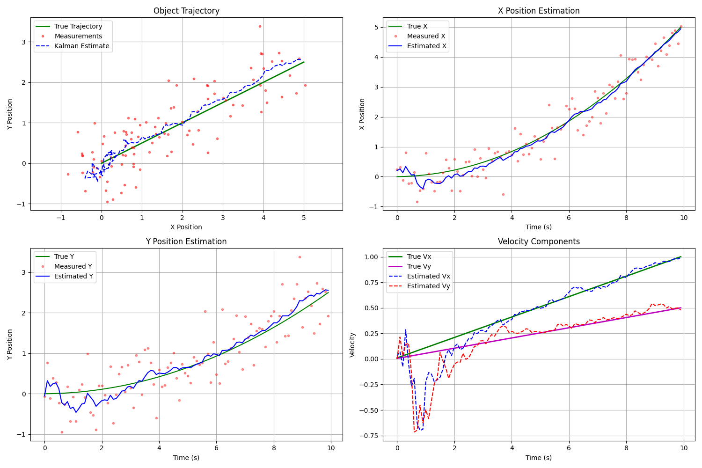
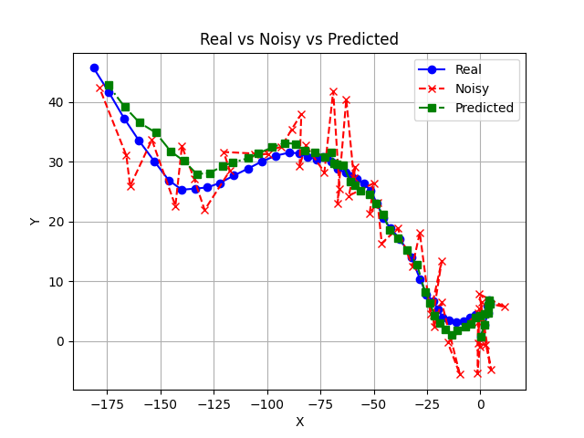

# KalmanFilter

Implementation of a basic Kalman Filter in Python and C++ for sensor data smoothing and noise reduction.

## Table of Contents

- [About](#about)  
- [Usage](#usage)  
  - [Python](#python)  
  - [C++](#c++)  
- [Installation](#installation)  
- [Project Structure](#project-structure)  
- [License](#license)  
- [Contact / Support](#contact--support)

## About

This repository provides a clear and minimal implementation of a Kalman Filter in two languages:

- **Python** – perfect for quick testing, prototyping, and educational purposes.  
- **C++** – optimized for performance-critical environments or embedded systems.

## Usage

### Python

```python
from kalman.kalman import KalmanFilter

# Example initialization
kf = KalmanFilter(initial_state=0.0, process_variance=1e-5, measurement_variance=1e-2)

measurements = [1.0, 2.0, 1.5, 1.8]
for m in measurements:
    state = kf.update(m)
    print(f"Updated state: {state}")
```
### Project structure
```
KalmanFilter/
├── main.py                    # Python script demonstrating usage
├── kalman/                    # C++ module
│   ├── CMakeLists.txt
|   ├── main.cpp
|   ├── matrix.cpp
|   ├── matrix.h
|   ├── kalmanfilter.cpp
|   ├── kalmanfilter.h
├── kalmanfilter/              # python module
|   └── kalman_filter.py
├── test/                      # Example data or test scripts
|   └── kalman_test.py
├── utils/                     # Utility scripts/helpers
|   └── util.py
└── README.md
```

## Results

Example output of filtering noisy data:
 

