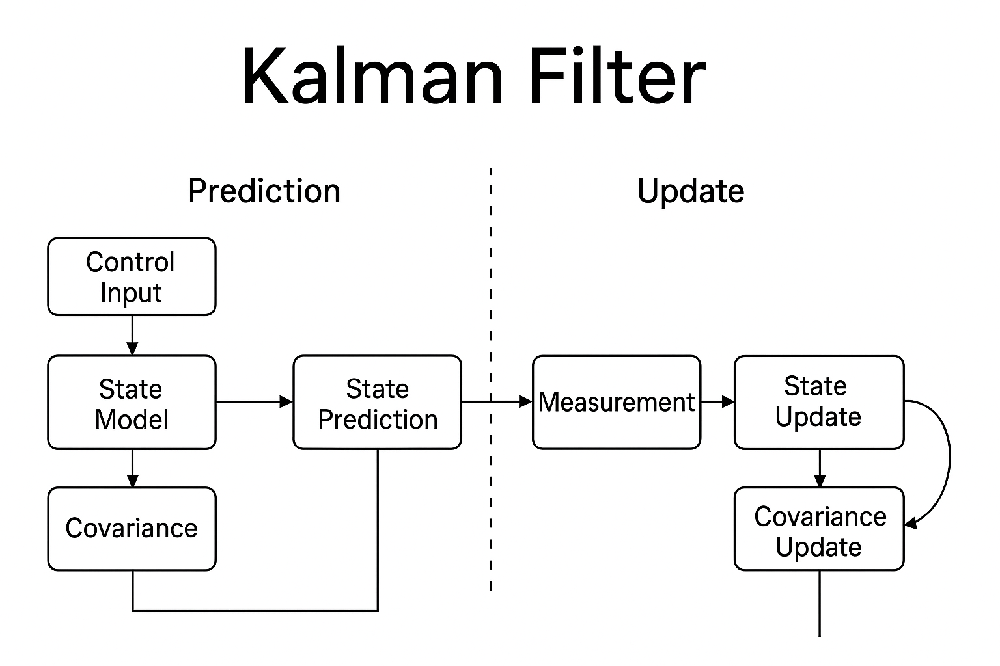

# Kalman Filter Project

## 📖 Introduction
The **Kalman Filter** is a mathematical algorithm used to estimate the hidden state of a dynamic system from a series of noisy or uncertain measurements. It works by combining predictions from a mathematical model of the system with incoming sensor data, continuously updating its estimates in a way that minimizes error. Unlike simple averaging, the Kalman Filter accounts for both process uncertainty (how the system evolves over time) and measurement noise (imperfections in sensors), making it highly effective in real-world applications where data is imperfect.  

This filter operates in two main steps: *prediction* and *update*. In the prediction step, it uses the system model to forecast the next state and its uncertainty. In the update step, it incorporates new measurements to refine the estimate, balancing trust between the model and the sensor data. Because of its efficiency and accuracy, the Kalman Filter is widely used in fields such as robotics, navigation, computer vision, and finance for tasks like object tracking, sensor fusion, and signal processing.  
 

---

## ✨ Features
- Implementation in **Python** and **C++**  
- State estimation from noisy measurements  
- Efficient real-time updates  
- Widely applicable in robotics, tracking, and navigation  

---

## 🔧 Installation
python >= 3.9

gcc & g++ >= 12.3.0

Clone this repository and install numpy:
```bash
git clone https://github.com/Abolmw4/KalmanFilter.git
cd KalmanFilter
pip install numpy
```

- for working with c++ version install **libeigen3-dev**

```bash
apt-get install libeigen3-dev
```

---

### Project structure
```
KalmanFilter/
├── main.py                    # Python script demonstrating usage
├── kalman/                    # C++ module
│   ├── CMakeLists.txt
|   ├── main.cpp
|   ├── matrix.cpp
|   ├── matrix.h
|   ├── kalmanfilter.cpp
|   ├── kalmanfilter.h
├── kalmanfilter/              # python module
|   └── kalman_filter.py
├── test/                      # Example data or test scripts
|   └── kalman_test.py
├── utils/                     # Utility scripts/helpers
|   └── util.py
└── README.md
```

---

## Table of Contents

- [About](#about)  
- [Usage](#usage)  
  - [Python](#python)  
  - [C++](#c++)  
- [Installation](#installation)  
- [Project Structure](#project-structure)  
- [License](#license)  
- [Contact / Support](#contact--support)

---

## Usage
...

---

## Results

Example output of filtering noisy data:
 

